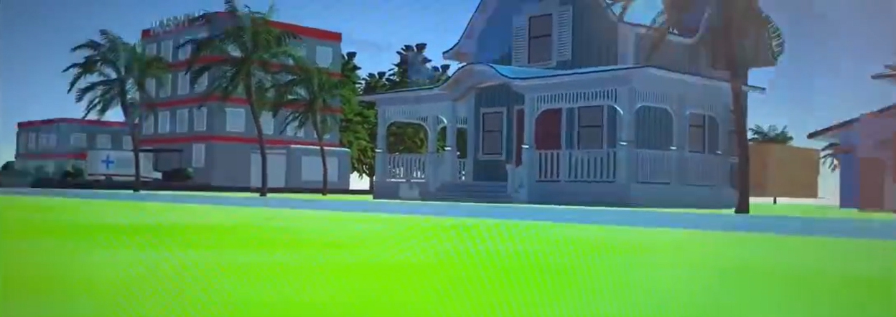
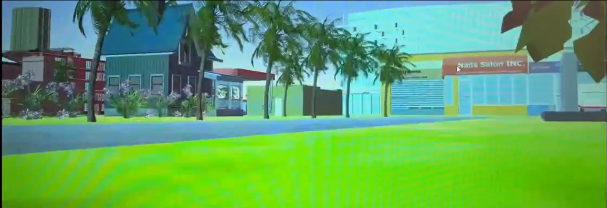
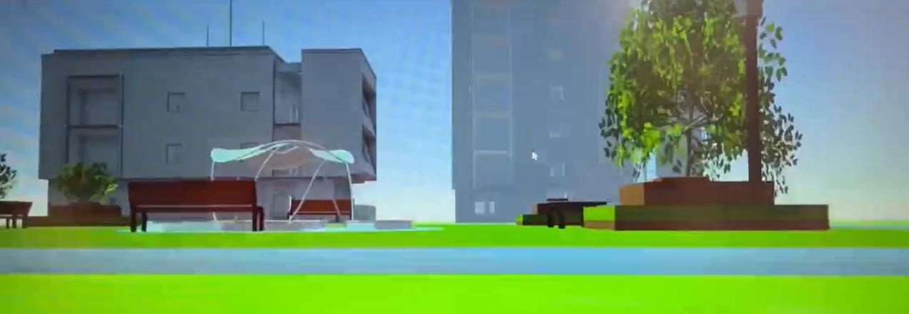
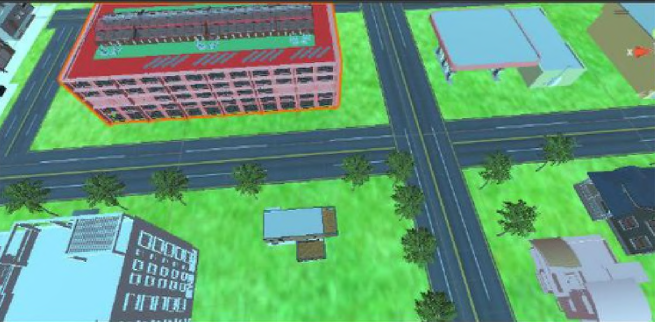
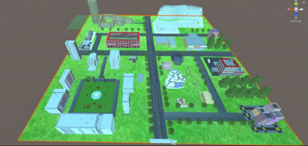

# City Tour: VR City using Unity

This is a Unity-based fully immersive 3D experience of a virtual city, featuring imported 3D models of buildings, landmarks, and environmental assets. The walkthrough allows users to explore a detailed and interactive representation of a city. The experience is designed to simulate a real-world environment, offering users the freedom to navigate and interact with key points of interest.

## Features
- **Imported 3D Models**: High-quality models of buildings, streets, and landmarks.
- **Interactive Navigation**: Walk, run, or fly through the city using intuitive controls.
- **User-Friendly Interface**: Clean UI with a mini-map, settings, and tooltips.
- **Cross-Platform Support**: Designed for [PC, WebGL, VR, etc.].

## Technical Details
- **Unity 3D**: Built using Unity 3D (version: 2022.3).
- **3D Models**: Imported from Blender, Maya, or SketchUp, or sourced from asset stores.
- **Post-Processing** : Effects like bloom, anti-aliasing, and color grading.
- **WebVR** : Used for showcasing the entire project in a VR environment.
- Scripting: C# scripts for interactivity, animations, and UI.

## Screenshots






## Installation
To run this project locally, follow these steps:

1. **Clone the Repository:**

```bash
git clone https://github.com/techyanimal/city-tour.git
cd city-tour
```

2. **Open in Unity:**
 - Ensure you have Unity Hub and Unity (Unity 2022.3 or higher) installed.

3. **Open the project in Unity by selecting the cloned folder.**

4. **Install Dependencies:**

- If using external assets, import them via the Unity Asset Store or Package Manager.

5. **Run:**
- Navigate to the "Scenes" folder and selected the scene we wanted to work on.
- Use WASD or arrow keys to move
  
## Use Cases
- **Tourism Promotion**: Showcase a real city to attract tourists.
- **Education**: Teach students about urban planning, architecture, or history.
- **Gaming**: Serve as a prototype for a city-building or exploration game.
- **Virtual Real Estate**: Allow users to explore properties or developments in a virtual environment.

## Contributing
Contributions are welcome! If you'd like to contribute:

- Fork the repository.

- Create a new branch (git checkout -b feature/YourFeature).

- Commit your changes (git commit -m 'Add some feature').

- Push to the branch (git push origin feature/YourFeature).

- Open a pull request.

Please ensure your code follows the project's coding standards and includes documentation where necessary.

## License
This project is licensed under the MIT License. See the [LICENSE](LICENSE) file for details.
